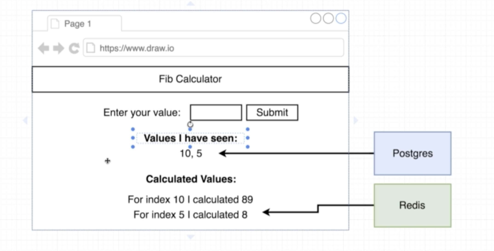
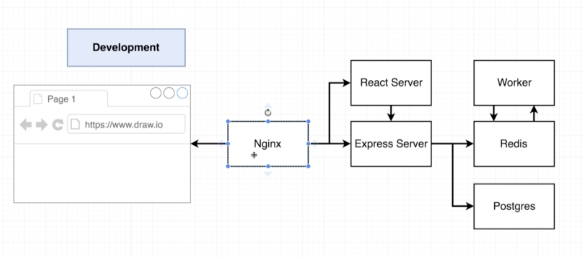

# Project Createion

Create [package.json](worker/package.json)

Add dependancies.
nodemon-live reload of code

redis client

scripts:
   start: node index.js
   dev: nodemon

create [index.js](worker/index.js)
const keys 
module.exports

function fib(index) {
    if (index < 2) return 1;
    return fib(index - 1) + fib(index - 2) 
})
App front end

# Create Server 

[Server](worker/../server/index.js)

deps: 
express
pg
redis
cors
nodemon

package.json
keys.js

#Create React App
create-react-app client
rm -r .git
https://create-react-app.dev/docs/getting-started#npx

# Docker compose file

docker-compose down && docker-compose up --build

# Deployment Steps
git init
git add .
git commit -m "initial commit"
git remote add origin https://github.com/JayneJacobs/multidockerFib.git
git push origin master

## [Travis](docs/Travis.md)

### Amazon ECS 
TaskDefinition 

https://docs.aws.amazon.com/AmazonECS/latest/developerguide/task_definition_parameters.html#container_definitions

## K8s

[Link to deployments](docs/K8s/Readme.md)

### logs
kubectl get pods 
kubectl logs client-deployment-686d59754b-kf5b9