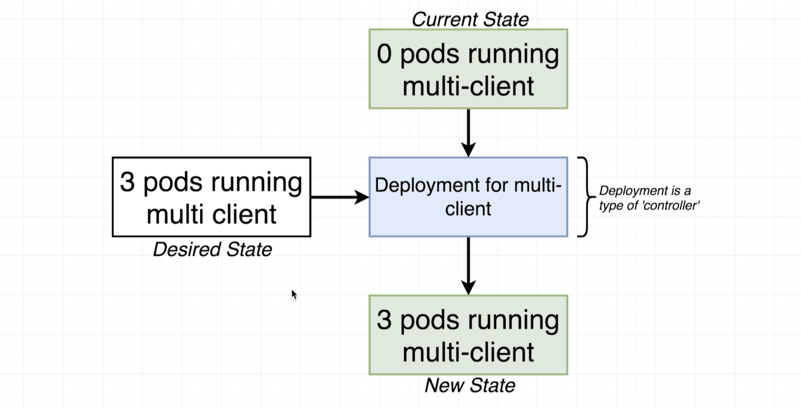
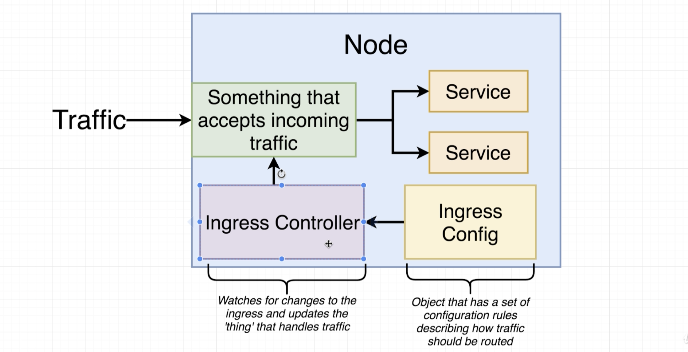
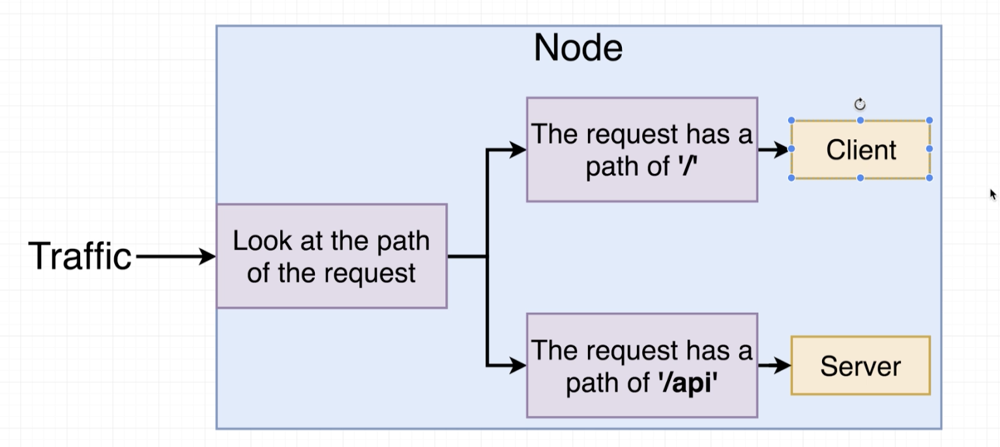

## LoadBalancer
   
   Outdated; Ingress is used. 

   AWS application LB

   Deprecated. 

   ## Ingress

   Exposes services 

   Nginx Ingress

   [ingress-nginx](https://github.com/kubernetes/ingress-nginx); community led

 nginx company ingress controller
  https://kubernetes.github.io/ingress-nginx/

    https://github.com/nginxinc/kubernetes-ingress

### Ingress Controller

Ingress routing rules




pod running nginx

 

[ Ingress config](../../k8s/ingress-service.yaml)


## Load balancer
nginx pod
default-backend pod

nginx is k8 aware 
   bypasses ClsuterIP service. 


## Ingress Nginx
 Hongli Lai - https://www.joyfulbikeshedding.com/blog/2018-03-26-studying-the-kubernetes-ingress-system.html.  creator of  Phusion Passenger, an extremely popular webserver that integrates with Nginx.

 

Then 
```kubectl apply -f k8s```

[kind Ingress](kindIngress.md)

kubectl get pods -n kube-system \
  -l app.kubernetes.io/name=ingress-nginx --watch


  ## Minikube
  minikube addons enable ingress
  kubectl delete  -f  k8s/
  kubectl apply -f  k8s/
  minikube ip
  nginx-ingress-controller version 
  
  kubectl get pods -n kube-system   -l app.kubernetes.io/name=ingress-nginx --watch
  kubectl describe pod ingress-nginx-admission-create-xln6n -n kube-system

  