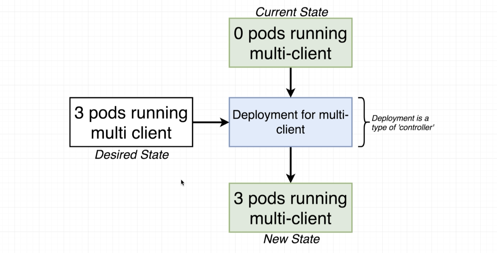

# Kubernetes

ls
 cd complex

 docker-compose  up --build

docker-compose down && docker-compose up --build


## External Port Limitations


# kubectl
  ```kubectl
  git checkout master
  kubectl get deploy 
  kubectl get deployments
  kubectl get services
  ```
## Deployment

kubectl apply -f <dir>
kubectl apply -f k8s

# 3 [Persistent Volumes](Storage.md)
Volume in Kubernetes; object that allows a container to store data a the pod level. 


## Secrets
Securely Stores information in the cluster db password


kubectl create secret generic pgpassword --from-literal PGPASSWORD=

kubectl get secrets

Error cannot convert int64 to string


## LoadBalancer
   
   Outdated; Ingress is used. 

   Deprecated. 

   ## [Ingress](Ingress.md)

   Exposes services 

   Nginx Ingress

# Deployment for multi-pod




 ## Not all items can be updated. some need to create new containers
 pod updates may not change fields other than `spec.containers. Ex. port numbers in container spec. 
 
 
 [*].image`, `spec.initContainers[*].image`, `spec.activeDeadlineSeconds` or `spec.tolerations` (only additions to existing tolerations)

 

 ## Deployments that create pods

 


 