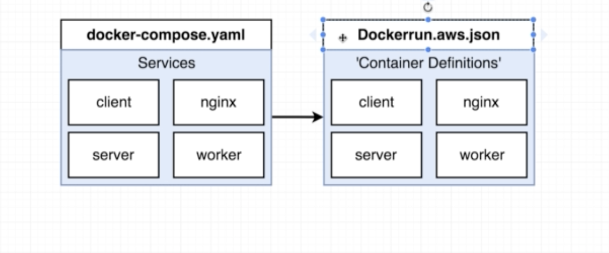
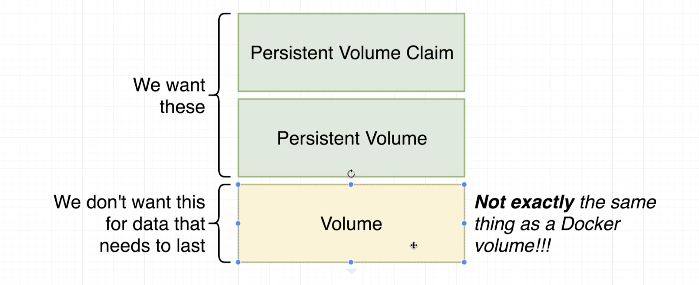
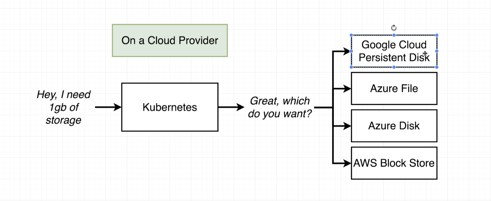

Persistent Volume Claim Persistent Volume.  



Kubernetes Volume disappears with the POD
Persistant Volume is maintained. 

Persistan volume claim is an advertisement for what is possible as an option. 

Statically provisioned Persistant volume: 
   Set up when the cluster is configured. 
Dynamically provisioned Persistant volume:
   Created on demand

   
### Storage Class

kubectl get storageclass
standard (default)   kubernetes.io/host-path   4d18h


```bash
kubectl describe storageclass 
Name:            standard
IsDefaultClass:  Yes
Annotations:     kubectl.kubernetes.io/last-applied-configuration={"apiVersion":"storage.k8s.io/v1","kind":"StorageClass","metadata":{"annotations":{"storageclass.kubernetes.io/is-default-class":"true"},"name":"standard"},"provisioner":"kubernetes.io/host-path"}
,storageclass.kubernetes.io/is-default-class=true
Provisioner:           kubernetes.io/host-path
Parameters:            <none>
AllowVolumeExpansion:  <unset>
MountOptions:          <none>
ReclaimPolicy:         Delete
VolumeBindingMode:     Immediate
```
## Cloud Volumes

Set up kubernettes to use cloud storage


## [PVC](../../k8s/Readme.md#L21)
kubectl apply -f k8s
kubectl get pv
