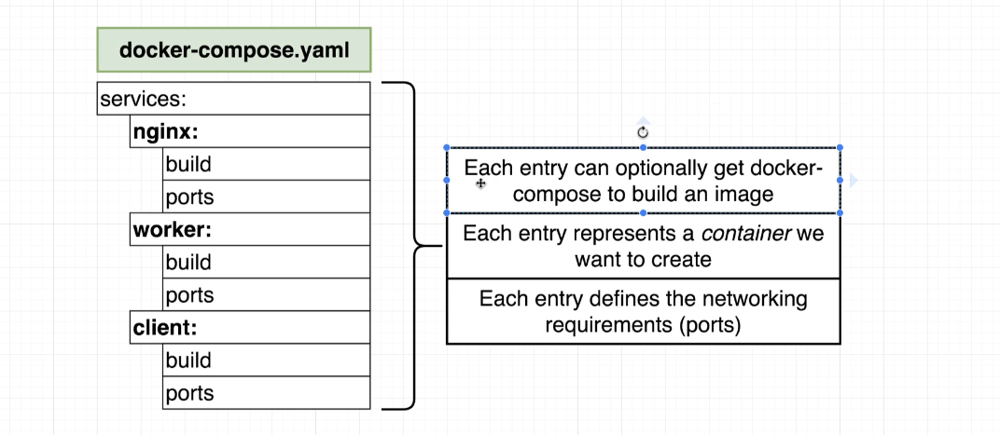
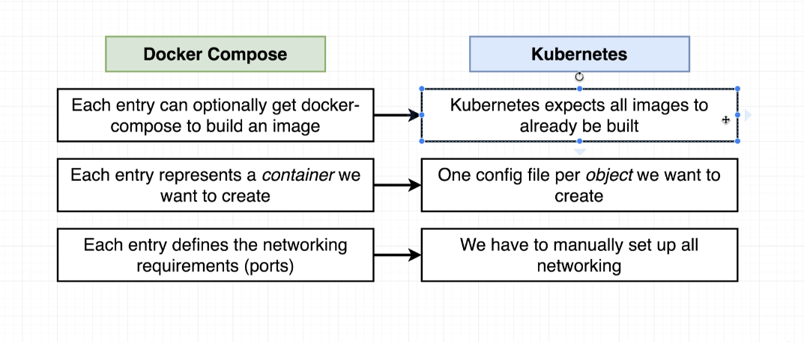
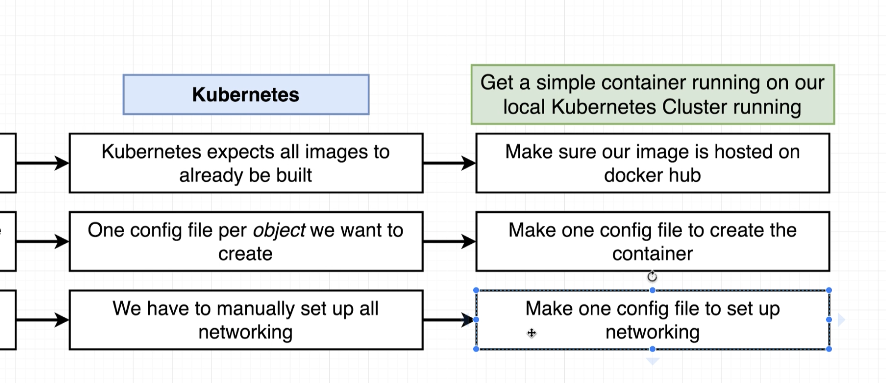

# Verify Minikube installation

minikube start --nodes 3 -p minikube
kubectl cluster-info
minikube start --driver=virtualbox --kubernetes-version=v1.14.3
minikube node add --worker
minikube node delete minikube-m02
minikube kubectl -- get nodes -A
minikube kubectl -- get pods -A
minikube ip
192.168.99.108:31515

## Translate Docker to Kubernetes

https://tips.tutorialhorizon.com/2016/06/29/how-to-fix-the-it-works-message-that-shows-up-on-localhost-on-your-mac/

## Expose minikube Docker Server VM
eval $(minikube docker-env)
docker ps

