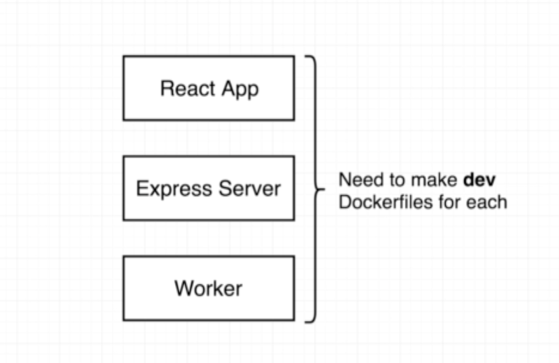
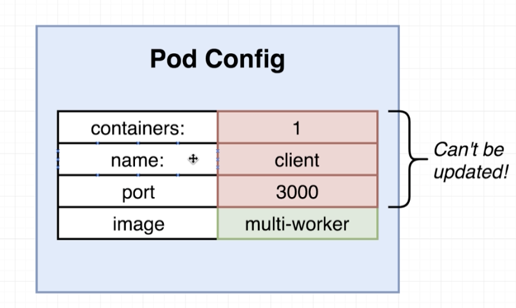
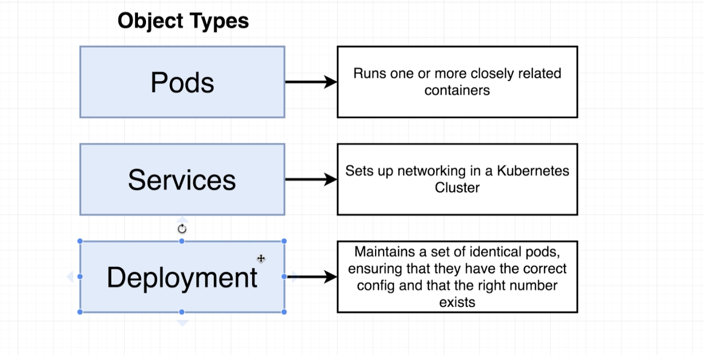

# Fib App Architecture

## [Worker ](Worker.md)

- Watches redis for indices
- Pulls new indice
- Calculates value
- puts value back in Redis. 

**Instead of this**:
in project root directory
npm install -g create-react-app

create-react-app client

**We need to run this command**:

npx create-react-app client

**Important Reminder**:

Once you have generated the React app you will need to delete the local git repository that Create React App may have automatically initialized.

Inside the newly created client directory, run rm -r .git

https://create-react-app.dev/docs/getting-started#npx

## Building DockerfileDev

Workflow

in client dir
docker build -f Dockerfile.dev .
Successfully built cf72fb4c447c

docker run cf72fb4c447c

# Docker compose file

in project root

### Postgress
image: 

**Update** the Postgres environment variable

Add the following to your docker-compose.yml file in the postgres service:

  postgres:
    image: "postgres:latest"
    environment:
      - POSTGRES_PASSWORD=postgres_password
 
2. Pin a specific version of the Node pg library

In your server/package.json file:

Change from this:

    "pg": "^8.0.3",

to this:

    "pg": "8.0.3",

3. Ensure that we delay the table query until after a connection is made.

In your server/index.js file:

Change these lines (likely lines 21 to 25):

pgClient.on('error', () => console.log('Lost PG connection'));
 
pgClient
  .query('CREATE TABLE IF NOT EXISTS values (number INT)')
  .catch(err => console.log(err));
 
to this:

pgClient.on('connect', () => {
  pgClient
    .query('CREATE TABLE IF NOT EXISTS values (number INT)')
    .catch((err) => console.log(err));
});
 
After making all of these changes make sure to run:

docker-compose down  && docker-compose up --build

Please note, all of these changes are reflected in the downloadable checkpoint zip files.

 ## Not all items can be updated. some need to create new containers
 pod updates may not change fields other than `spec.containers. Ex. port numbers in container spec. 
 
 
 [*].image`, `spec.initContainers[*].image`, `spec.activeDeadlineSeconds` or `spec.tolerations` (only additions to existing tolerations)

 

 

 ## Deployment has pod template

 