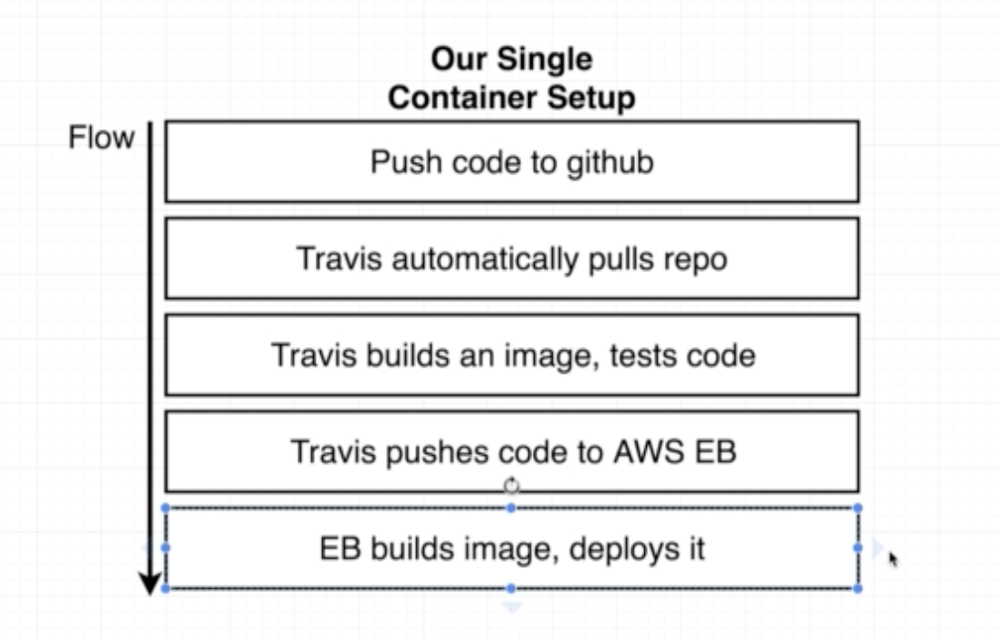
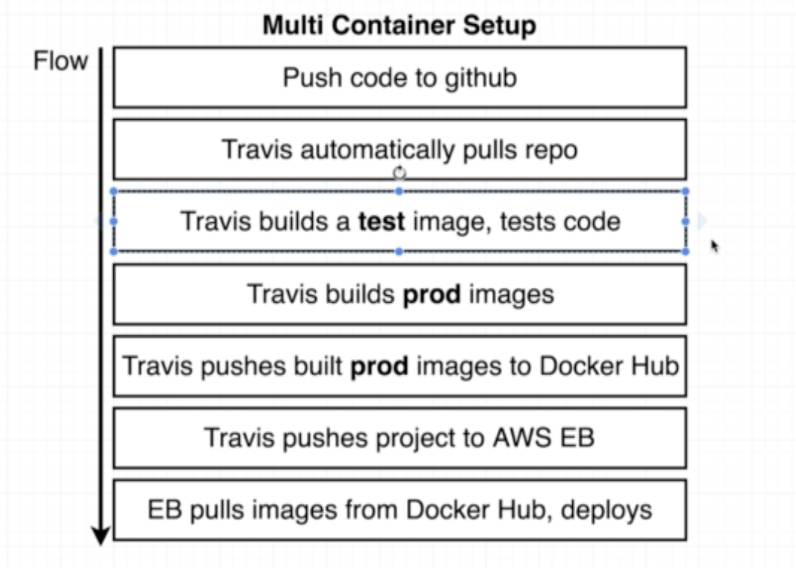

# Travis Workflow

EB Build

Mutlitcontainer setup 

## Travis Builds production image

Push image to hub. 

You can read up on the CI=true variable here:

https://facebook.github.io/create-react-app/docs/running-tests#linux-macos-bash

and enviornment variables in Docker here:

https://docs.docker.com/engine/reference/run/#env-environment-variables