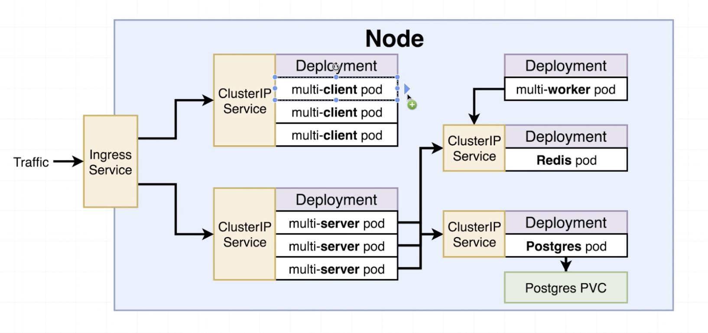
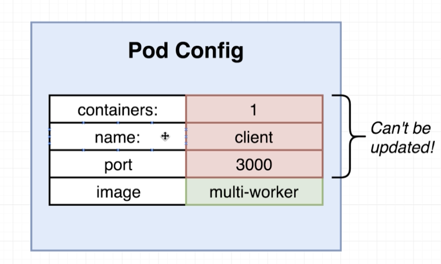

# K8 deployment


## Cluster IPs. 

Nothing can address a pod directly. Internal addresses are used between the Master load balancer and the internal network. 


External sources must use port numbers between 30000-32767


Colocating configs

---

The other configuration


### PVC
Persistent Volume Claim. 
Needed for postgres. Redis is an in-memory data store. 
```
kubectl get pvc
NAME                               STATUS    VOLUME   CAPACITY   ACCESS MODES   STORAGECLASS   AGE
database-persistent-volume-claim   Pending                                      standard       6m17s
```




kubectl delete -f client-pod.yaml

kubectl apply -f  k8s/client-deployment.yaml 

kubectl get deployments

```sh
kubectl get deployments -o wide
NAME                READY   UP-TO-DATE   AVAILABLE   AGE    CONTAINERS   IMAGES                     SELECTOR
client-deployment   3/3     3            3           2m2s   client       jaynejacobs/multi-client   component=web
```

IP cannot be used externally


## Changing pod spec in the deployment
This will cause the pod to be deleted and recreated.


# Dashboard
curl -O https://raw.githubusercontent.com/kubernetes/dashboard/v2.0.4/aio/deploy/recommended.yaml

